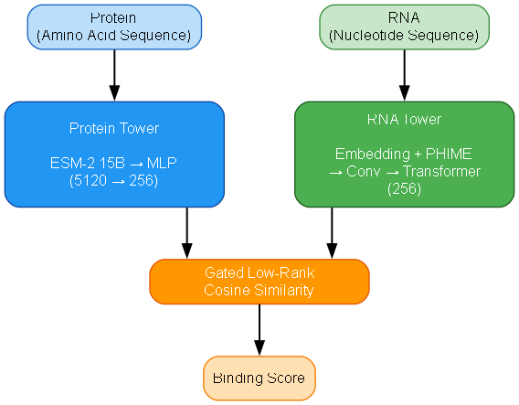

# Predicting RNAcompete Binding from an Amino-Acid Sequence — Design Document

**Author:** Safwan Butto

**Course:** Deep Learning in Computational Biology

**Project:** Predicting RNAcompete binding based on an amino-acid sequence

## Abstract

We present a two-tower neural model that predicts RNAcompete probe intensities for **unseen RNA-binding proteins (RBPs)** using only their amino-acid sequences. The **protein tower** uses frozen **ESM-2 15B** (hidden size 5120) embeddings projected to a compact representation; the **RNA tower** encodes nucleotides and fuses lightweight secondary-structure channels (**PHIME**). A gated low-rank cosine head produces a score per RNA probe.
**Model selection** used an RBP-disjoint split on the **deduplicated training set (176 RBPs)** into **Train 132 / Val 44**, achieving **median Pearson $r = 0.4403$** on the **validation** RBPs. For the **final test submission**, we **retrained on all 176 RBPs** and obtained **mean Pearson $r = 0.29$** on the hidden **test set of 44 RBPs**, ranking **1st of 12 groups** (next best $r = 0.21$). The repository includes notebooks for RBP deduplication, secondary-structure features, and the full model and training pipeline.

## Model Architecture



## 1. Problem & Data

### 1.1 Task

Given an **amino-acid sequence** for an unseen RBP and a list of **RNA probes** (30–41 nt), predict the **binding intensity** for each probe as measured by RNAcompete.

### 1.2 Inputs & Outputs

**CLI (inference):**

```bash
python main.py <OUT_DIR> <RBP_FILE> <RNA_FILE>
# example
python main.py predictions test_RBPs2.txt test_seqs.txt
```

*Arguments*

* `<OUT_DIR>`: directory to write outputs (created if missing).
* `<RBP_FILE>`: **44** RBPs, one amino-acid sequence per line (A–Z).
* `<RNA_FILE>`: RNA probes (one per line, {A,C,G,U}; 30–41 nt; $\approx 120{,}678$ lines).

*Output*
One text file per RBP in `<OUT_DIR>`, each containing a float score per RNA **in the same input order**.

> **Code availability:** End-to-end preprocessing, modeling, and training are implemented in the repository notebooks; the CLI wraps inference using artifacts produced by these notebooks.

### 1.3 Datasets

**Training**

* `training_data2.txt`: matrix **$120{,}678$ RNAs $\times$ 200 RBPs** (float intensities).
* `training_RBPs2.txt`: **200** amino-acid sequences.
* `training_seqs.txt`: **$120{,}678$** RNA sequences (30–41 nt).

**Test**

* `test_RBPs2.txt`: **44** amino-acid sequences (unseen RBPs).
* `test_seqs.txt`: RNA probe set (distinct from training probes).

**Assumptions**
$T \rightarrow U$ normalization applied; line indices consistent across cached artifacts; output order must match input order exactly.

## 2. Method

### 2.1 Architecture (two-tower)

**Shared embedding size:** $D_{\text{MODEL}} = 256$

#### Protein tower

Per-residue embeddings from **ESM-2 15B** (hidden 5120, frozen) are mean-pooled and projected $5120 \rightarrow 512 \rightarrow 256$ with GELU, LayerNorm, and Dropout 0.3. Source-wise $z$-score is applied on training RBPs before projection. *At inference,* `PROT_EMB_DIM` is loaded from the checkpoint and must match `esm_emb_test.npy`.

#### RNA tower

Token embeddings for {A,C,G,U} plus learned positional encodings. Predicted secondary-structure channels (**PHIME**, 5 per position) are fused via $\mathrm{Linear}(5\!\rightarrow\!256)$ + GELU + LayerNorm with a residual add. Sequence modeling uses **3 dilated Conv1d** blocks ($k=5/9/13$; dilations $=1/2/4$) and a **Transformer encoder** (2 layers, 4 heads, dropout 0.3). A **gated pooling** layer yields a fixed-dim vector; LayerNorm applied.

#### Scoring head

**Gated low-rank cosine bilinear** head (rank $=512$) combines protein and RNA embeddings; cosine similarity is computed in a learned low-rank space with protein-conditioned gating over rank components.

### 2.2 Targets & Pre/Post-processing

* $\log1p$ transform, **clip at the 99.5th percentile**, then **$z$-score per RBP** (training RNAs).
* **RBP de-duplication:** PWM/consensus clustering removes duplicates (**200 $\rightarrow$ 176**; 24 dropped across 13 clusters). Training matrix and RBP list are sliced to representatives before $\mu/\sigma$ and protein embedding caching.
* **Structure features:** **PHIME** precomputed per test RNA and verified against sequence indices.

### 2.3 Training Protocol

* **Model selection / ablations:** RBP-disjoint split on deduplicated RBPs → **Train 132 / Val 44**. Best validation checkpoint selected by **median Pearson $r$**.
* **Final test run:** **Retrain on all 176 RBPs** with the selected hyperparameters; evaluate once on the hidden **test set of 44 RBPs** (leaderboard metric = **mean Pearson $r$**).

**Objective**

$$
\mathcal{L} \;=\; 0.2\,\mathrm{Huber}_{\delta=1.0} \;+\; 0.8\,\bigl(1 - r\bigr),
\qquad r=\mathrm{Pearson}(\hat{y},y).
$$

**Optimizer** AdamW (lr $=10^{-4}$, weight decay $=10^{-2}$; protein-MLP WD $=3\times10^{-4}$)
**Schedule** up to **50 epochs** (best by validation median $r$)
**Precision** FP32 and **AMP**; **AMP $\approx 2\times$ faster**; test model trained with AMP
**Stabilization** Dropout, weight decay, **EMA** ($\text{decay}=0.999$)
**Eval-time TTA** 5 repeats; Gaussian noise $\sigma=0.01$ on protein vectors; averaged
**Caching** training ESM embeddings cached as `cache/esm_emb_train_dedup.npy`

### 2.4 Final Hyperparameters

| **Component**      | **Setting**                                                                            |
| ------------------ | -------------------------------------------------------------------------------------- |
| $D_{\text{MODEL}}$ | 256 (kept small to avoid overfitting)                                                  |
| Low-rank head rank | **512** (tested 128/256/512/1024 → 512 best)                                           |
| RNA Transformer    | 2 layers, 4 heads, dropout 0.3                                                         |
| Protein MLP        | $5120 \rightarrow 512 \rightarrow 256$, dropout **0.3**                                |
| RNA convs          | $k=5/9/13$; dilations $=1/2/4$                                                         |
| Structure fusion   | **PHIME** $5\!\rightarrow\!256$ + residual                                             |
| Optimizer          | AdamW, lr $=1\mathrm{e}{-4}$, WD $=1\mathrm{e}{-2}$; protein-MLP WD $=3\mathrm{e}{-4}$ |
| Training           | up to **50 epochs**, best checkpoint by median $r$; AMP on                             |
| TTA                | disabled by default; TTA $N=5$, noise $=0.01$                                          |
| Inference batch    | `RNA_BATCH=1000`, `BASE_OFFSET=200`, `FMT='%.8f'`                                      |
| ESM model          | **ESM-2 15B** (hidden 5120)                                                            |

### 2.5 Parameter Search (what we tried → what we kept)

* **Protein LMs:** multiple ESM-2 sizes and a **hybrid ESM-650M + ProtT5**; larger ESM-2 outperformed the hybrid → kept **ESM-2 15B**.
* **Dropout:** {0.1, 0.2, **0.3**} → **0.3** best.
* **Bilinear rank:** {128, 256, **512**, 1024} → **512** best.
* **Model width:** larger $D_{\text{MODEL}}$ gave minor gains and more overfitting → kept **256**.
* **EMA:** stabilized training without raising peak metric → kept.
* **RNA dedup:** little benefit beyond RBP dedup → not used.
* **Structure features:** probability-style channels yielded small gains → kept **PHIME** fusion.

## 3. Results

### 3.1 Internal Validation (Train 132 / Val 44, RBP-disjoint)

From the training log:

* **Best median Pearson $r$:** **0.4403** at **epoch 43** (mean $r$ **0.4152**; eval time $\approx$ **36.0 s**).
* **Other reference points:** epoch 29 (0.4280 / 0.4060), epoch 40 (0.4351 / 0.4137), epoch 50 (0.4374 / 0.4158).

**Selected checkpoints**

|     **Epoch** | **Median $r$** | **Mean $r$** | **Eval time (s)** |
| ------------: | -------------: | -----------: | ----------------: |
|             1 |         0.0909 |       0.1300 |              70.6 |
|            10 |         0.3622 |       0.3714 |              36.4 |
|            20 |         0.4206 |       0.3963 |              36.1 |
|            29 |         0.4280 |       0.4060 |              36.2 |
|            40 |         0.4351 |       0.4137 |              36.2 |
| **43 (best)** |     **0.4403** |   **0.4152** |          **36.0** |
|            50 |         0.4374 |       0.4158 |              36.0 |

*Loss trajectory (mini-batch means):* \~**0.709 → 0.306** across training.

### 3.2 Final Test Set (Hidden; 44 RBPs) — Trained on All 176 RBPs

* **Protocol:** retrain on **all 176 RBPs** (post-dedup), then evaluate once on the hidden **test set of 44 RBPs**.
* **Leaderboard metric:** **mean Pearson $r$** across RBPs.
* **Outcome:** **1st of 12 groups** with **mean $r = 0.29$**; **second place $r = 0.21$** → margin $\Delta r = 0.08$.

| **Rank** | **Group**                 | **Mean $r$** |
| -------: | ------------------------- | -----------: |
|        1 | Ours (trained on all 176) |     **0.29** |
|        2 | Next best                 |         0.21 |

> Note: Internal validation reports **median** $r$ on a fixed split (132/44); the test leaderboard uses **mean** $r$ after retraining on **all** 176 RBPs.

## 4. Performance Characterization

### 4.1 Runtime (grading metric)

The grading score uses average prediction time over **44 RBPs**:

$$
\max\!\Bigl(\min\!\bigl(1,\; 2 - \tfrac{\text{time [s]}}{600}\bigr),\; 0\Bigr).
$$

**Environment** Google Colab **A100** (PyTorch)
**End-to-end runtime (44 RBPs)** $\approx$ **30 minutes** with AMP enabled
**Validation-loop eval timing** \~**36 s** per evaluation of the 44 validation RBPs

### 4.2 Memory & Utilization

| **Item**        | **Value**                                  |
| --------------- | ------------------------------------------ |
| GPU             | A100                                       |
| GPU peak memory | **6 GB** (excluding embedding calculation) |

## 5. Implementation & Reproducibility

* **Code availability:** All project code is in the repository notebooks:

  * **RBP deduplication** (data cleaning and clustering)
  * **Secondary-structure feature calculation (PHIME)**
  * **Model and training** (end-to-end pipeline)
* **Environment:** Google Colab (A100, PyTorch, AMP enabled)
* **Determinism:** seed 1 where applicable; some CUDA kernels are nondeterministic
* **CLI contract:** `python main.py <OUT_DIR> <RBP_FILE> <RNA_FILE>`
* **I/O guarantees:** preserves RNA input order; outputs one float per line

## 6. Discussion

**Strengths** Strong generalization to unseen RBPs via protein LMs; lightweight RNA encoder with structure fusion; stable training (EMA) and a correlation-aware objective
**Limitations** Dependence on ESM-2 (compute/memory); **PHIME** quality tied to folding assumptions; no cross-RBP score calibration

**Contrastive learning** Beyond the supervised Pearson/MSE setup, we tried a CLIP-style variant: within a square-batch $64\times64$ we aligned protein–RNA pairs via Hungarian matching and optimized a symmetric InfoNCE loss with a learned temperature, alongside a small regression head to $z$-scored intensities (multi-task). Blocks were sampled online from curated pools (hi/mid/low/hard; $0.60/0.15/0.15/0.10$); CLIP applied only on hi steps, with hard negatives mined by competitor quantiles. Training was stable (AMP) but underperformed the pure supervised objective on dev median $r$, likely due to limited RBP diversity and weak in-batch negatives.

**Future work** Scale RBPs and negatives; temperature/curriculum tuning; stronger hard-negative mining; hybrid supervised–contrastive schedules; cross-attention between protein and RNA; structure-aware contrastive pretraining at scale; parameter-efficient adapters

## References

* Ray et al., *Nature Biotechnology* (2009): RNAcompete
* Eitamar Tripto and Yaron Orenstein. *A comparative analysis of RNA-binding proteins binding models learned from RNAcompete, RNA Bind-n-Seq and eCLIP data*
* Jonathan Karin, Hagai Michel, Yaron Orenstein. *MultiRBP: Multi-task neural network for protein-RNA binding prediction*
* Yang et al., *Bioinformatics* (2020): protein/RNA representation learning
* ViennaRNA Package: secondary-structure prediction
* ESM-2: Transformer protein language model

## Troubleshooting

* **“Missing struct dir: `struct_test`”** Ensure the unzipped structure folder is named exactly `struct_test/` and sits next to `main.py`.
* **Shape mismatch in protein projection** `esm_emb_test.npy` must match checkpoint `PROT_EMB_DIM`; re-export embeddings if needed.
* **No `esm_emb_train.npy`** Fine; test $z$-scoring is skipped automatically.
